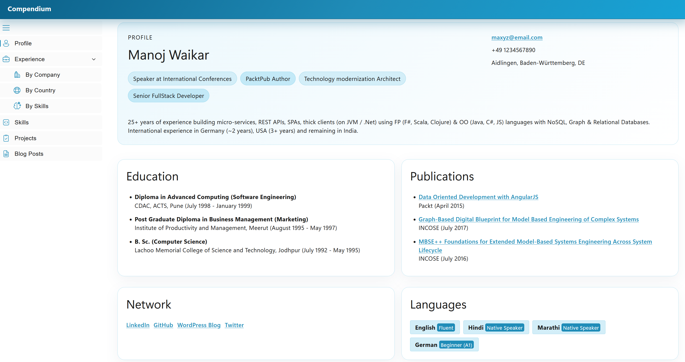
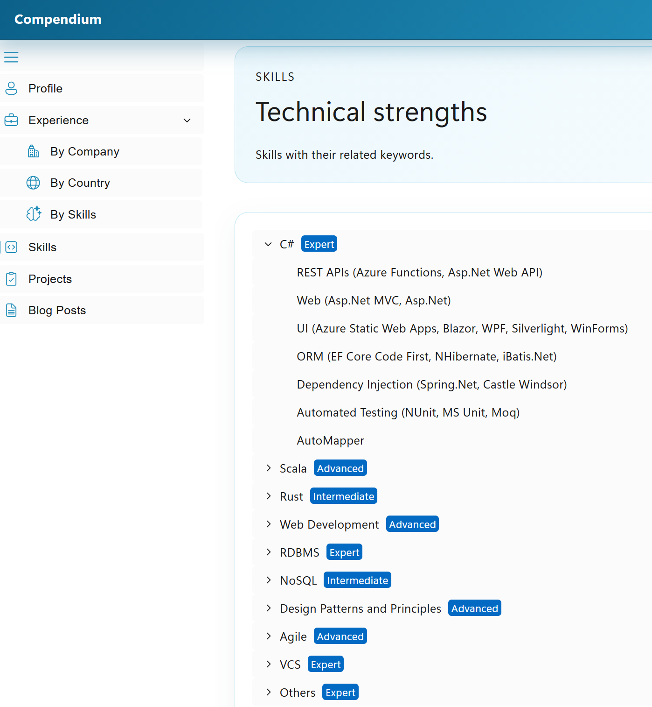
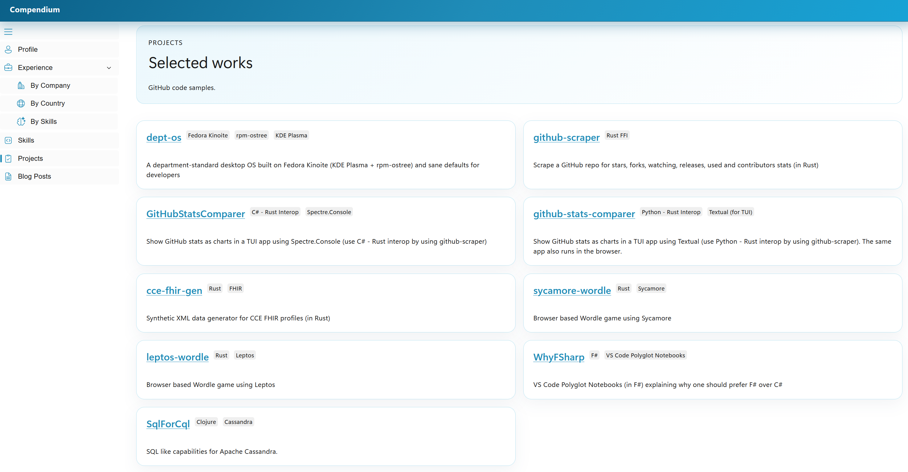
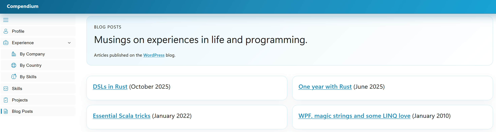

# Requirements

I want to build a resume visualizer in Rust. The app will be a client side app and will be hosted on GitHub pages. It will mimic the visualizer which I built using C# Blazor, called [Compendium](https://www.codionics.com/Compendium/). It should:

- use the rust [gpui](https://gpui.rs/) crate and components from the [gpui-kit](https://github.com/longbridge/gpui-kit)
- although the gpui advertises itself as a desktop library, the [gpui-kit](https://gpui-kit.com/) website runs gpui components in a browser
- have a header, footer, left sidebar and the main area in between
- the left sidebar shows:
  - Profile
  - Experience
    - By Company: shows the experience in a company (in months) in a bar chart 
    - By Country: should show experience in compnies, grouped by countries as a nodes-edges graph using [cytoscape.js](https://js.cytoscape.org/). When a country is expanded, the companies for that country should be shown
    - By Skills: should show experience grouped by skills (same nodes-edges graph as above). When a skill is exanded, the sub-skills should be shown
  - Skills
  - Projects
  - Blog Posts

## Changes

### 5-Sep-2026 compendium-section-visual-refresh

Can you change the following sections:

1. profile section should look like 
2. skills section should look like 
3. projects section should look like 
4. blog posts section should look like 

I like the current colors so don't use the blue visual language but keep the current colors.
