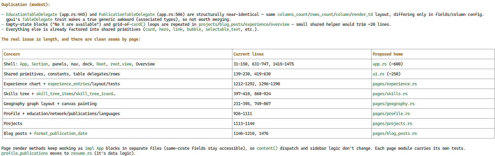
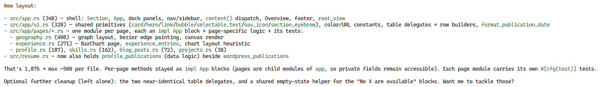

# Implementation Notes

### Here are the notes suggested by [OpenCode](https://opencode.ai) after the initial Geography graph implementation:

### After the first round of arranging code in modules:

